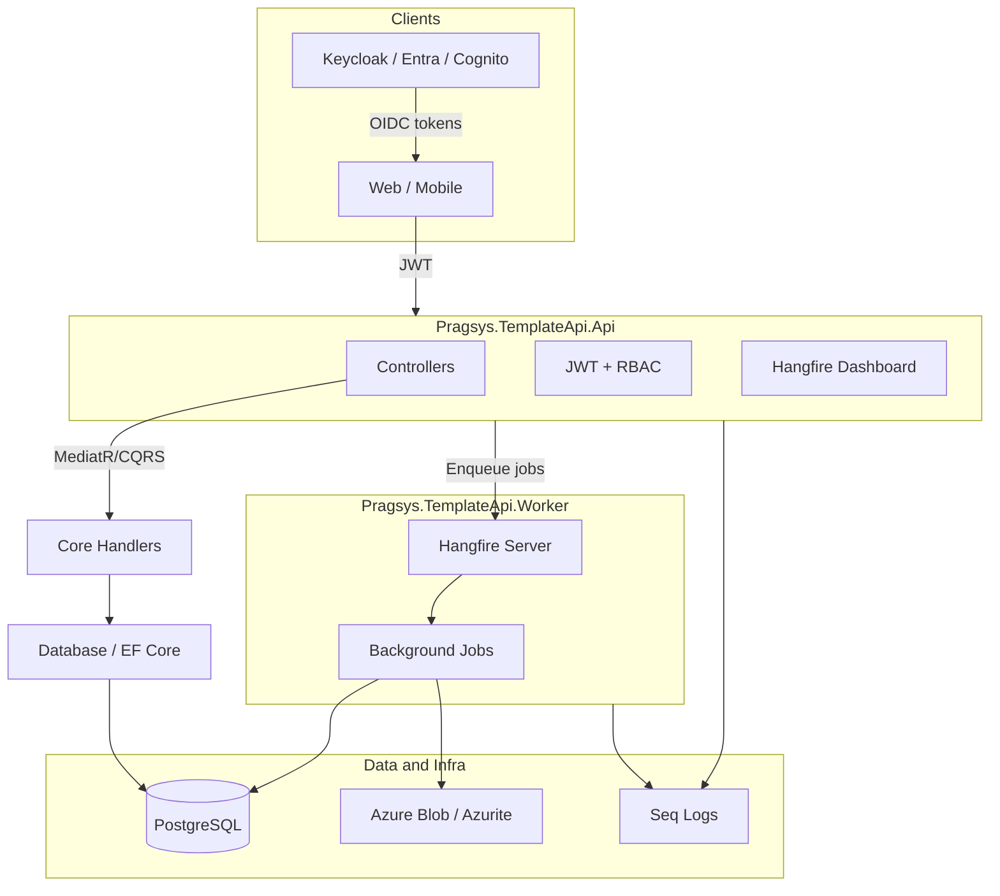

# Pragsys.TemplateApi — How It Works in a Modern Organization

This repository is a **golden template** from [Pragmatic Systems](https://github.com/pragmatic-systems). It is not a product you deploy as-is, but the **standard starting point** for new .NET APIs inside a modern engineering organization.

## What It Is

`Pragsys.TemplateApi` is a **`dotnet new` solution template**. Teams install it once, then scaffold new services with a consistent name:

```bash
dotnet new install <path-to-cloned-repo>
dotnet new Pragsys.TemplateApi --ProjectName:MyAppName
```

The `--ProjectName` parameter renames namespaces and projects everywhere (`Pragsys.TemplateApi` → `MyAppName`), so every new service starts from the same baseline.

## Architecture

The solution uses a **multi-service, layered** layout that maps cleanly to how organizations run APIs in Kubernetes or other container platforms.



| Project | Role in the organization |
|--------|-----------------------------|
| **Api** | HTTP surface: controllers, Swagger, auth, rate limiting, Hangfire dashboard |
| **Worker** | Separate background-job host (Hangfire server) — typical split for scale and deployment |
| **Core** | Business logic via CQRS handlers (`InsertTodo`, `SelectTodo`) |
| **Database** | EF Core + DbUp migrations (SQL scripts embedded in assembly) |
| **Instrumentation** | Shared cross-cutting concerns: Serilog, health/metrics, Postgres init, Hangfire wiring |

The sample domain is a **Todo List API** with CSV upload → blob storage → background import. It is enough to demonstrate real patterns (auth, async work, storage) without being a full product.

## How It Fits a Modern Organization

### 1. Platform / Golden Path Engineering

Instead of every team inventing structure, the organization publishes **one blessed template** with:

- Project layout
- Auth model (OIDC + role-based policies like `TodoList:Read`, `TodoList:Write`)
- Observability endpoints (`/_system/ping`, `/_system/health`, `/_system/metrics`)
- Dockerfiles for Api and Worker
- CI/CD recipes

New teams run `dotnet new` and get most of “how we build APIs here” for free.

### 2. Identity and Security

The template is **IdP-agnostic**. Documentation covers:

- **Keycloak** (local development)
- **Azure Entra ID** (Microsoft environments)
- **AWS Cognito** (AWS environments)

JWT validation, Swagger bearer auth, and policy-based RBAC are wired in from day one. Pre-commit runs **Betterleaks** secret scanning via Husky — a common organizational guardrail before code reaches the remote.

### 3. DevOps and Quality Gates

**Local developer loop:**

```bash
docker compose -f docker-compose.infra.yml up   # Postgres, Seq, Keycloak, Azurite
dotnet format                                    # required for CI
dotnet cake                                      # test + benchmark + lint
```

**CI on pull requests** (`.github/workflows/build-and-test-action.yml`):

- Lint (`dotnet format --verify-no-changes`)
- Unit and integration tests (with coverage and CTRF reports on the PR)
- Benchmarks
- SonarCloud analysis
- Artifacts uploaded

**CI on merge to `main`** (`.github/workflows/pack-and-push-action.yml`):

- Same quality bar, then **pack and push** to private NuGet and container registry
- Versioning via **GitVersion** (semver from git history)

This follows the common **“PR = verify, main = publish”** model used by platform teams.

### 4. Observability by Default

Every service exposes:

- **Health checks** for orchestrators (for example, Kubernetes liveness/readiness)
- **Prometheus metrics** for SRE and monitoring stacks
- **Structured logging** (Serilog → Seq locally; in production, usually Datadog, Grafana, Loki, and similar)

Teams do not need to bolt this on later — it is part of the template contract.

### 5. Testing Strategy

| Layer | Tooling |
|-------|---------|
| Unit tests | Validators, auth transformers |
| Integration tests | SpecFlow/Reqnroll BDD features + test containers / mock OIDC |
| Benchmarks | Performance baselines for hot paths |

Integration tests spin up a **TestRuntime** with a mocked identity provider — how organizations keep CI fast without real Keycloak in every pipeline.

### 6. Container-First Deployment

Docker images are defined for Api and Worker (Database migrator is optional):

- Built and tagged with semver in Cake
- Pushed to a **private registry** (GitHub Container Registry or similar via organization variables and secrets)

In a modern organization this typically flows: **template repo → team repo → CI builds images → deploy to Kubernetes, AKS, EKS, or App Service**.

## Typical Organization Workflow

```text
Platform team maintains Pragsys.TemplateApi
        │
        ▼
Developer: dotnet new Pragsys.TemplateApi --ProjectName:OrdersApi
        │
        ▼
Customize domain (replace Todo with Orders), keep structure
        │
        ▼
PR → GitHub Actions (lint, test, Sonar, test report comment)
        │
        ▼
Merge to main → Docker images + optional NuGet packages published
        │
        ▼
Deploy Api + Worker separately; Postgres, blob, and IdP from org infra
```

## Opinionated Choices

The template standardizes on:

- **.NET 8+** with StyleCop analyzers
- **MediatR-style CQRS** (`Pragsys.CQRS`)
- **PostgreSQL** with snake_case naming
- **Hangfire** for background jobs (shared DB, dashboard behind auth)
- **Azure Blob** (Azurite locally) for file and async patterns
- **Cake** as the single build orchestrator (local and CI use the same script)
- **DbUp** migrations run on startup in development (production may run the migrator as a separate job)

## What Teams Change Per Product

The template stays generic; each product team typically:

1. Renames or replaces the Todo domain
2. Points auth configuration at organizational Entra, Cognito, or Okta
3. Swaps connection strings and blob storage for managed cloud services
4. Adds team-specific GitHub organization variables (`SONARORG`, `PRIVATE_CONTAINER_REGISTRY`, and similar)
5. Optionally enables the Database Dockerfile for init-container migration jobs in Kubernetes

## Summary

In a modern organization, this repository is an **internal platform product**: a **tested, secure, observable, container-ready API scaffold** with **enforced engineering standards** (formatting, secret scanning, Sonar, coverage, semver, private registry). Platform engineering owns the template; product teams **instantiate and extend** it instead of bootstrapping from `dotnet new webapi` and rebuilding auth, metrics, CI, and job processing each time.
